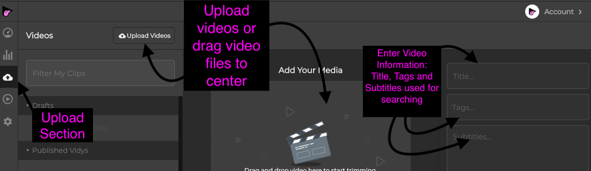

<div align="center">
  
</div>

<div align="center">
  <a href="https://npmjs.org/package/@vidy/embed">
    
  </a>
  <a href="https://semaphoreci.com/vidy/embed-js">
    
  </a>
  <a href="https://codecov.io/gh/VIDY/embed.js">
    
  </a>
  <a href="https://packagephobia.now.sh/result?p=@vidy/embed">
    
  </a>
</div>

<div align="center">The JavaScript SDK for Vidy Embeds</div>


# Table of Contents:
* [Usage](#usage)
	* [Register](#1-register-with-vidy-and-create-a-dashboard-account)
	* [Install](#2-install-the-vidy-sdk-onto-your-page)
	* [Embed and Publish](#3-embed-and-publish-vidys-onto-a-page)
* [Application ID and PostID](#application-id-and-postid)
* [Dynamic Vidy SDK installation](#advanced-dynamic-installation)
  * :bulb: [Examples](https://github.com/VIDY/embed-web-examples)!
  * [API](#api)
* [Browser Support](#browser-support)


## Usage
To use the Vidy SDK to embed Vidys onto your page, there are 3 main steps:
### 1. Register with Vidy and Create a Dashboard Account
* <a href = 'https://dashboard.vidy.com/register'>Register Link</a>
* Once registered, visit your dashboard
	*  <a href = "https://dashboard.vidy.com/">Dashboard Link</a>
*  Create a new Application (**APP**) and give it a name.
	* Take note of the **app id** that is created, however all of your **app ids** can be found on the settings section under ```APPLICATIONS``` 
	 * <a href="https://dashboard.vidy.com/settings/applications">Settings/applications link</a>
   * NOTE: You can create and maintain more than one Application at a time.
* Visit [Application ID and PostID](#application-id-and-postid) for the importance of the APP_ID and PostID
### 2. Install the Vidy SDK onto your page.

*****This is a a very simple, one page, integration setup with the purpose of gaining general understanding of the SDK. For more dynamic and advanced methods of intergration of the SDK onto multiple pages or entire domains, please visit [Advanced Dynamic Installation](#advanced-dynamic-installation)*****

***basic setup***
 1. Install the Vidy SDK script directly into your HTML
 
 ```html 
 <script src="https://unpkg.com/@vidy/embed/dist/embed.min.js"></script>
 ```
> This registers the `Vidy` constructor globally.

2. Create an instance of Vidy. Simply put: start Vidy on your page
 
```html
<script>
let vidy = new Vidy({
  appid: '2199e8c8-abcd-efgh-a123-d463129790c5', // USE YOUR APPID  
  postid: 'some-unique-slug-identifier', //page identifier
  content: '#article', //optional field: location of content
  // in html doc
  autoload: true
  });
	</script>
```
##### With these scripts added to your page HTML, Vidy SDK integration is complete for your page. 

**NOTES** 

1. _This basic installation assumes your text content exists on your page when the Vidy instance is created_
2. Your **appid** and **postid** are critical to the successful integration of the Vidy SDK. Please Visit [Application ID and PostID](##Application-ID-and-POSTID) for a detailed explanation of these options.   
	
### 3. Embed and Publish Vidys onto a Page
#####  This works much better with the Vidy Dashboard desktop app
<a href="https://vidy-app.s3.amazonaws.com/production/latest/Vidy-0.2.11-mac.zip">Vidy Dashboard Download [MAC]<a> | <a href="https://vidy-app.s3.amazonaws.com/production/latest/Vidy-0.2.11-linux.zip">Vidy Dashboard Download [Linux]<a> | <a href="https://vidy-app.s3.amazonaws.com/production/latest/Vidy-0.2.11-win.zip">Vidy Dashboard Download [Windows]<a>

##### but can be done on the <a href = "https://dashboard.vidy.com/">Dashboard Website</a> as well.
1. **Upload your video clips**. 
	1. visit the upload section of your dashboard and upload your videos. 
		* This can be found under the Upload section of the Desktop app or <a href="https://dashboard.vidy.com/upload/info">Upload Section</a> on the web. 
		* Upload your Video, Enter the title, tags, and subtitle information for the video. These must be filled out as these will be used to search for the uploaded video at embed time. 
		
2. **Embed your videos**
	1. Visit the ```Preview``` section of the your dashboard and enter your page URL at the top
	   * <a href="https://dashboard.vidy.com/preview">Preview Section Link</a> for web
	3. Highlight the text on your page you wish to embed
		* The search bar (on the left) will be immediately populated with the highlighted text.
		* Change the search to find the uploaded video you wish to embed.
	5. Once You found the video you want, hit the ```+``` on the right corner and your video is now embeded.
		* Your highlighted text should now be highlighted pink to signify it is now an embeded text and your a list of all your embeds on the current page will be on the right. 
    
3. **Publish your embeded clips as Vidys live on the web**. 
	1. If your preview is the way you want it, hit ```PUBLISH``` on the right corner of the preview section tab and you're DONE 	
	2. Your clips have been successfully embeded as Vidys on your page and they are live on the web! To view them live, simply navigate to your page on any broswer and watch your Vidys spice up your page and watch your traffic interact with your Vidys!


## Application ID and POSTID
#### Understanding the APP ID
```html
<script>
let vidy = new Vidy({
   appid: '2199e8c8-abcd-efgh-a123-d463129790c5', // <------
   postid: 'some-unique-slug-identifier', 
  ....
	</script>
```
The **appid** field in the Vidy constructor is the same APP ID that is found on your Vidy Dashboard.

The **appid** is used to group pages together into a single application. Simply speaking, an **APPLICATION** is a  ***website*** and the **appid** is the ***website identifier*** 

Examples:

https://www.washingtonpost.com/ may have an appid: '2199e8c8-abcd-efgh-a123-d463129790c5'

while

https://www.nytimes.com/ may have an appid: '9921c8e8-klmn-opqr-b456-c236181973d4' 

The **appid** belongs to a specific dashboard account, therefore you cannot add Vidys to an Application (website) you do not own.

Similarly no one else besides you and your dashboard account can add Vidys to your Application (website) even if they possess your **appid**

#### Understanding the POSTID
```html
<script>
let vidy = new Vidy({
  appid: '2199e8c8-abcd-efgh-a123-d463129790c5',
  postid: 'some-unique-slug-identifier', // <------
  ....
	</script>
```

The **postid** is the page identifier. Each page of a website must have their own **UNIQUE** **postid**.

If we continue from our above examples

https://www.washingtonpost.com/ may have an appid: '2199e8c8-abcd-efgh-a123-d463129790c5'

and  page from the WashingtonPost website:

https://www.washingtonpost.com/opinions/2019/01/31/what-democrats-are->missing/?utm_term=.b26d79555a08

may have postid: 'what-democrats-are-missing'  <------ UNQIUE POSTID


yielding this page's HTML script for Vidy instantiation to look like:
>```html
><script>
>let vidy = new Vidy({
>appid: '2199e8c8-abcd-efgh-a123-d463129790c5', //Fake WashingtonPost APPID  
>postid: 'what-democrats-are-missing', //UNIQUE page identifier 
>//content:#article if content field used
>autoload: true
>  });
></script>
>```

***A different Page from the same website, WashingtonPost***

https://www.washingtonpost.com/business/2019/01/31/an-angry-historian-ripped-ultra-rich-over-tax-avoidance-davos-then-one-was-given-mic/?utm_term=.638ecb85827a

may have a postid:"ultra-rich-over-tax" <--- POSTID

yielding this page's HTML script for Vidy instantiation to look like:
>```html
><script>
>let vidy = new Vidy({
>appid: '2199e8c8-abcd-efgh-a123-d463129790c5', //SAME WashingtonPost APPID  
>postid: "ultra-rich-over-tax", //UNIQUE page identifier 
>  //content:#article if content field used
>  autoload: true
>  });
></script>
>```

In the examples above, notice how the two different pages share the same **appid** because they from the same website. However, each of the page's **postid** is ***unique*** causing they're Vidy instantiation **postid** to be different

#### APPID, POSTID, and Content API GUIDELINE
#### appid:
Type: `String`<br>
Required: `true`

The Application (website) identifier.<br>
Created and or found on the Vidy Dashboard

#### postid:
Type: `String|Number`<br>
Required: `true`

The unique identifier for any given page.

Most web frameworks have built-in helpers to generate & ensure unique page identifiers; You may also resort to using the ```location.pathname```, if necessary.

***POSTID and APPID combination are what allows for the SDK to find the Vidys associated to each page.***

#### content
Type: String<br>
Default: 'body'

The html selector of the parent container that wraps the text content Vidy should traverse.


## Advanced Dynamic Installation

```
$ npm install --save @vidy/embed
```

Then with a module bundler like [rollup](https://rollupjs.org/) or [webpack](https://webpack.js.org/), use as you would anything else:

```js
// using ES6 modules
import Vidy from '@vidy/embed';

// using CommonJS modules
const Vidy = require('@vidy/embed');
```

:bulb: Looking for examples? [We got you covered](https://github.com/VIDY/embed-web-examples)!

***Dynamic Setup &mdash; AKA, no autoload***

_When text is rendered dynamically / after script execution._

```js
import Vidy from '@vidy/embed';

let selector = '#article';
let div = document.querySelector(selector);
let pathname = location.pathname; //=> eg "hello-world"

let vidy = new Vidy({
  appid: '2199e8c8-abcd-efgh-a123-d463129790c5',
  postid: pathname,
  content: selector
});

// Query our own Blog API for JSON
fetch(`/api/posts/${pathname}`).then(r => r.json()).then(data => {
  // Add text to the container we care about!
  div.innerHTML = data.html;
  // Manually call load()
  vidy.load();
});
```

## API

### Vidy(options)

Returns: `Vidy`

Returns the `Vidy` instance.

#### options.appid

Type: `String`<br>
Required: `true`

The Application identifier.

> You may create a new Vidy Application for free [here](#todo)! :tada:

#### options.postid

Type: `String|Number`<br>
Required: `true`

The unique identifier for any given page.

Most web frameworks have built-in helpers to generate & ensure unique page identifiers; see [some examples](https://github.com/VIDY/embed-web-examples) for help. You may also resort to using the `location.pathname`, if necessary.

> **Important:** This should be immutable; each `postid` yields its own specific list of Vidy Embeds!

#### options.content

Type: `String`<br>
Default: `'body'`

The selector of the parent container that wraps the text content Vidy should traverse.

For example, given the following markup:

```html
<body>
  <div id="app">
    <header id="top">
      <nav>...</nav>
    </header>
    <div class="wrapper">
      <main id="content">
        <article>
          <!-- content lives here -->
        </article>
        <div id="comments">...</div>
      </main>
      <aside id="sidebar">
        <div id="trending-posts">...</div>
        <div id="related-posts">...</div>
      </aside>
    </div>
  </div>
</body>
```

By default, the Vidy SDK will grab ***all text*** on the page, including comments, related & trending post widgets, etc. You _probably_ don't want the SDK placing links in these areas.

Instead, you could pass `content: '#content'`, targeting the article _and_ the comments' text; or you can narrow link placements within the article exclusively via the `'#content > article'` selector.

#### options.autoload

Type: `Boolean`<br>
Default: `false`

Whether or not the SDK should immediately draw link around text phrases.

If the text within [`options.content`](#optionscontent) is loaded dynamically (eg, via an API or a headless CMS), then `autoload` should retain the `false` default.

> **Important:** This should _only_ be `true` if your content is included in the server response!


### init(postid)

The method that appends the SDK elements to the page, if they don't already exist. It also queries the Vidy API for the list of Embeds (both social & advertising) that belong to the given `postid`.

If no `postid` is received, the SDK uses the value provided on instantiation &mdash; see [`options.postid`](#optionspostid) for more.

You should only need to invoke this method after successfully navigating to a new page on a client-side application.

> **Note:** This is always called automatically when creating a new `Vidy` instance.

### load()

The method that draws Vidy links around their relevant phrases.

At this point, the SDK expects and traverses text content within the [`options.content`](#optionscontent) container.

> **Note:** This is called automatically when [`options.autoload`](#optionsautoload) is true.


## Browser Support

The JavaScript SDK relies on [`fetch`](https://caniuse.com/#search=fetch) and [`Promise`](https://caniuse.com/#search=promise) support, which yields these minimum browsers:

* Edge 14+
* Firefox 40+
* Chrome 42+
* Safari 10.1+
* iOS 10.3+

The SDK will automatically download polyfills for `fetch` and `Promise` if it does not detect these globals.

> **Note:** To use the polyfills you already provide, ensure that `window.fetch` and `window.Promise` are defined.


## License

MIT © [VIDY](https://vidy.com)
